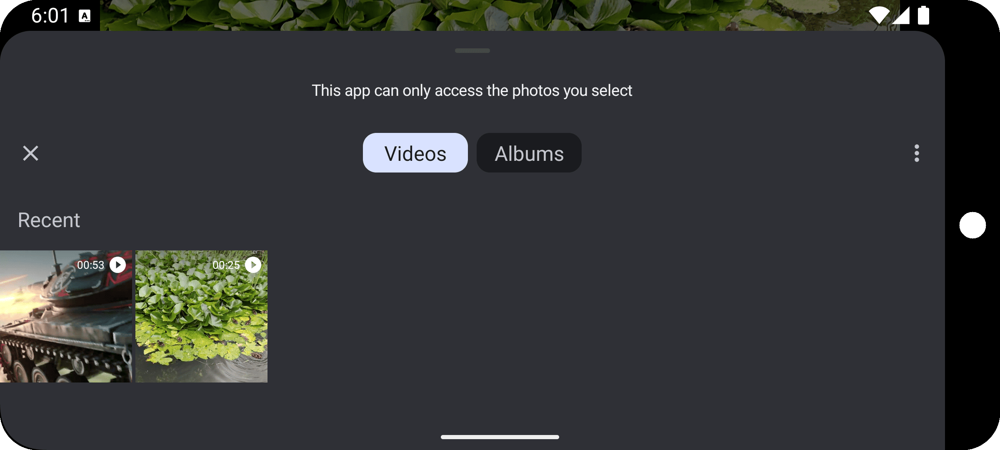

# YVideo Lite - Simple Video Player (Compose/ExoPlayer)

This is a simple, ad-free video player application built entirely with Jetpack Compose, utilizing
ExoPlayer through `androidx.media3:media3-ui-compose`.

**Motivation:** Beyond the core goal of creating a distraction-free video player, this project is an
exploration of implementing ExoPlayer purely in Jetpack Compose. Given that the Compose-specific
ExoPlayer implementation is still evolving, this app provides a custom solution for essential
features like a Time Bar (which is currently lacking in the official version).

**Key Features:**

* **Default Video App:** Capable of being set as the default application for playing video files.
* **File Opening:** Directly open video files from within the application.
* **Playback History:** Maintains a history of viewed videos within the app's lifecycle (using
  `SavedStateHandle`).
* **History Navigation:** Navigate forward and backward through the playback history using dedicated
  buttons.
* **Playback Speed Control:** Adjust the video playback speed.
* **Aspect Ratio Control:** Change the aspect ratio of the video.
* **Shuffle Mode:** Enable/disable shuffle mode.
* **Repeat Mode:** Enable/disable repeat mode.

**Screenshots:**

<table>
  <tr>
    <td style="text-align: center; width: 50%;">
      
    </td>
    <td style="text-align: center; width: 50%;">
      
    </td>
  </tr>
  <tr>
    <td style="text-align: center;" colspan="2">
      
    </td>
  </tr>
  <tr>
    <td style="text-align: center;" colspan="2">
      
    </td>
  </tr>
  <tr>
    <td style="text-align: center;" colspan="2">
      
    </td>
  </tr>
  <tr>
    <td style="text-align: center;" colspan="2">
      
    </td>
  </tr>
  <tr>
    <td style="text-align: center;" colspan="2">
      
    </td>
  </tr>
</table>

**Notable Technologies & Architecture:**

* **Hilt:** Dependency Injection.
* **ViewModel:** For managing UI-related data in a lifecycle-conscious way.
* **MVI (Foundation):** A foundation for Model-View-Intent architecture (currently a work in
  progress).
* **ViewModel-Based Player:** The ExoPlayer instance is created and managed within a ViewModel. This
  provides several advantages:
    * Configuration Change Resilience: Preserves player state across configuration changes (e.g.,
      screen rotation).
    * Recomposition Efficiency: Avoids creating a new ExoPlayer instance on every recomposition.
    * Proper Resource Management: Ensures proper resource release via `onCleared()`.
* **Custom Time Bar:** This app features a custom Time Bar implemented in Jetpack Compose. It
  provides essential seeking functionality for local video playback only, and does not implement the
  full `androidx.media3.ui.TimeBar` interface.

**Inspiration & References:**

* **Google's Compose Demo:** Inspired by the experimental Compose demo from
  Google: [https://github.com/androidx/media/tree/release/demos/compose](https://github.com/androidx/media/tree/release/demos/compose)
* **Philipp Lackner's Video Player:** Some ideas were taken
  from: [https://github.com/philipplackner/VideoPlayerCompose](https://github.com/philipplackner/VideoPlayerCompose)

## Getting Started

This project requires Android Studio and a basic understanding of Android development.

1. Clone the repository: `git clone https://github.com/YMVDev/YVideoLite.git`
2. Open the project in Android Studio.
3. Build and run the app on an emulator or physical device.

## Contributing

Contributions are welcome! Please feel free to submit pull requests with bug fixes, new features, or
improvements to the code.

When submitting a pull request, please:

* Follow the existing code style.
* Write clear and concise commit messages.
* Explain the purpose of your changes in the pull request description.

Thank you for your contributions!

---

# YVideo Lite - Простой Видеоплеер (Compose/ExoPlayer)

Это простое приложение для просмотра видео, созданное полностью с использованием Jetpack Compose и
использующее ExoPlayer посредством `androidx.media3:media3-ui-compose`. В приложении нет рекламы.

**Мотивация:** Помимо основной цели - создать видеоплеер без отвлекающих факторов, этот проект
представляет собой попытку реализации ExoPlayer исключительно в Jetpack Compose. Учитывая, что
Compose-специфичная реализация ExoPlayer все еще находится в разработке, это приложение предлагает
пользовательское решение для основных функций, таких как Time Bar (которая в настоящее время
отсутствует в официальной версии).

**Основные функции:**

* **Приложение для видео по умолчанию:** Может быть установлено в качестве приложения по умолчанию
  для воспроизведения видеофайлов.
* **Открытие файлов:** Непосредственно открывайте видеофайлы из приложения.
* **История воспроизведения:** Сохраняет историю просмотренных видео в течение жизненного цикла
  приложения (с использованием `SavedStateHandle`).
* **Навигация по истории:** Перемещайтесь вперед и назад по истории воспроизведения с помощью
  специальных кнопок.
* **Контроль скорости воспроизведения:** Регулируйте скорость воспроизведения видео.
* **Контроль соотношения сторон:** Изменяйте соотношение сторон видео.
* **Режим перемешивания:** Включите/выключите режим перемешивания.
* **Режим повтора:** Включите/выключите режим повтора.

**Основные технологии и архитектура:**

* **Hilt:** Внедрение зависимостей (Dependency Injection).
* **ViewModel:** Для управления данными, связанными с UI, с учетом жизненного цикла.
* **MVI (Основа):** Основа для архитектуры Model-View-Intent (в настоящее время находится в
  разработке).
* **Плеер на основе ViewModel:** Экземпляр ExoPlayer создается и управляется внутри ViewModel. Это
  дает несколько преимуществ:
    * Устойчивость к изменениям конфигурации: Сохраняет состояние плеера при изменениях
      конфигурации (например, при повороте экрана).
    * Эффективность перекомпозиции: Избегает создания нового экземпляра ExoPlayer при каждой
      перекомпозиции.
    * Правильное управление ресурсами: Обеспечивает правильное освобождение ресурсов через
      `onCleared()`.
* **Custom Time Bar:** Это приложение включает в себя пользовательский Time Bar, реализованный в
  Jetpack Compose. Он обеспечивает основную функциональность поиска позиции воспроизведения только
  для локальных видеофайлов и не реализует полный интерфейс `androidx.media3.ui.TimeBar`.

**Вдохновение и ссылки:**

* **Демо Compose от Google:** Вдохновлено экспериментальным демо Compose от
  Google: [https://github.com/androidx/media/tree/release/demos/compose](https://github.com/androidx/media/tree/release/demos/compose)
* **Видеоплеер от Philipp Lackner:** Некоторые идеи были взяты
  из: [https://github.com/philipplackner/VideoPlayerCompose](https://github.com/philipplackner/VideoPlayerCompose)

## С чего начать

Этот проект требует Android Studio и базовое понимание разработки под Android.

1. Клонируйте репозиторий: `git clone https://github.com/YMVDev/YVideoLite.git`
2. Откройте проект в Android Studio.
3. Соберите и запустите приложение на эмуляторе или физическом устройстве.

## Вклад

Приветствуются любые вклады! Пожалуйста, не стесняйтесь отправлять pull request'ы с исправлениями
ошибок, новыми функциями или улучшениями кода.

При отправке pull request'а, пожалуйста:

* Соблюдайте существующий стиль кода.
* Пишите четкие и краткие сообщения коммитов.
* Объясните цель ваших изменений в описании pull request'а.

Спасибо за ваш вклад!

## License

Copyright 2025 YMVDev

Licensed under the Apache License, Version 2.0 (the "License");
you may not use this file except in compliance with the License.
You may obtain a copy of the License at

    http://www.apache.org/licenses/LICENSE-2.0

Unless required by applicable law or agreed to in writing, software
distributed under the License is distributed on an "AS IS" BASIS,
WITHOUT WARRANTIES OR CONDITIONS OF ANY KIND, either express or implied.
See the License for the specific language governing permissions and
limitations under the License.
